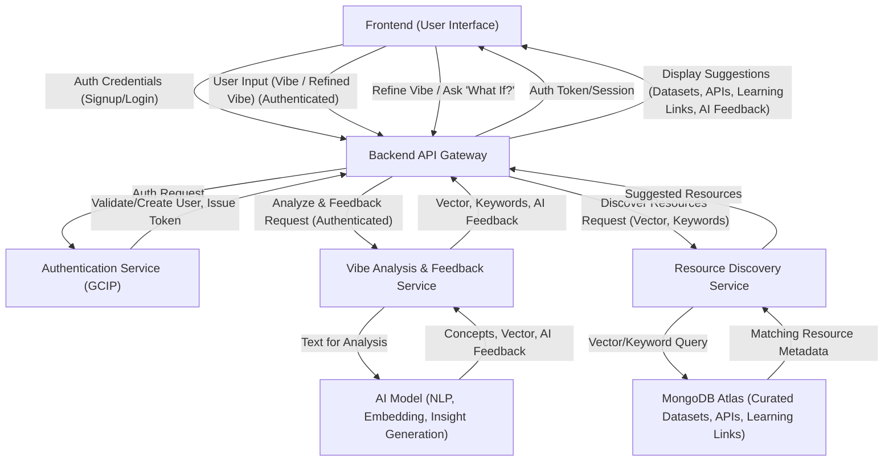

# VibeFlow System Data Flow Diagram (Interactive Refinement Focus)

This diagram illustrates the primary data and control flow within the VibeFlow application, focusing on its role as an interactive refinement and learning tool. It is based on the component relationships outlined in `systemPatterns.md`.

This diagram illustrates the revised flow focusing on iterative refinement and resource discovery. The VibeFlow platform itself is hosted on Google Cloud Run.
