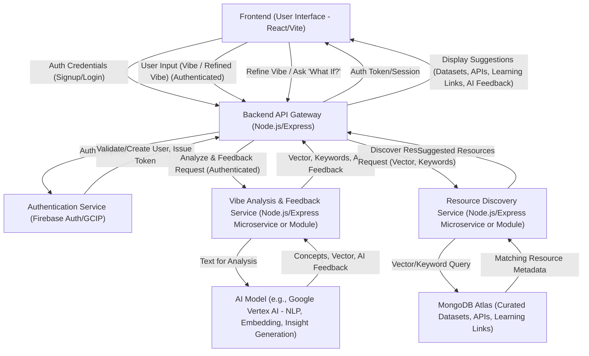

# System Patterns: VibeFlow

## 1. High-Level Architecture
VibeFlow employs a **Client-Server Architecture** with a distinct separation between the frontend (client) and backend (server) components.
*   **Frontend:** A Single Page Application (SPA) responsible for user interaction, rendering the UI, and communicating with the backend via API calls.
*   **Backend:** A set of services responsible for business logic, AI processing, data storage, and authentication.
The entire application appears to be designed for containerization (presence of Dockerfiles) and cloud deployment (mentioned as Google Cloud Run in `SystemDataFlowDiagram.md`).

## 2. Key Architectural Components & Flow
The system's core functionality revolves around user input ("vibe"), AI-driven analysis, resource discovery, and iterative refinement. The `SystemDataFlowDiagram.md` provides a good overview:

**Component Breakdown (Inferred & from Diagram):**
*   **Frontend (User Interface):**
    *   Likely built with **React** (common for SPAs, `vite.config.ts`, `App.tsx`).
    *   Build system: **Vite** (from `vite.config.ts`).
    *   Handles user input, displays suggestions, and manages client-side state.
*   **Backend API Gateway:**
    *   Likely **Node.js with Express.js** (common for TypeScript backend, `package.json` in `vibeflow-backend` would confirm).
    *   Acts as the primary entry point for all frontend requests.
    *   Routes requests to appropriate internal services/modules.
    *   Handles request/response transformations.
*   **Authentication Service:**
    *   Explicitly mentioned as **Google Cloud Identity Platform (GCIP)** in the diagram (Firebase Auth is built on GCIP).
    *   Manages user registration, login, and token issuance/validation.
*   **Vibe Analysis & Feedback Service:**
    *   Could be a separate microservice or a distinct module within the backend monolith.
    *   Interfaces with an **AI Model** (e.g., Google Vertex AI, OpenAI) for Natural Language Processing (NLP), generating embeddings, and deriving insights/feedback.
*   **Resource Discovery Service:**
    *   Could be a separate microservice or a distinct module.
    *   Queries a **MongoDB Atlas** database containing curated datasets, APIs, and learning resources.
    *   Uses vectors or keywords from the Vibe Analysis service to find relevant resources.
*   **AI Model:**
    *   An external or managed AI service (e.g., Google Vertex AI, OpenAI API).
    *   Provides capabilities for text analysis, embedding generation, and potentially generative feedback.
*   **Database (MongoDB Atlas):**
    *   Stores curated information about datasets, APIs, and learning materials.
    *   Likely structured to support efficient querying based on vectors or keywords.

## 3. Key Technical Decisions & Patterns
*   **TypeScript:** Used across both frontend and backend (implied by `tsconfig.json` files and `.ts` extensions), promoting type safety and maintainability.
*   **RESTful APIs:** Standard pattern for communication between frontend and backend.
*   **Token-based Authentication:** JWTs or similar tokens issued by GCIP/Firebase Auth for securing API endpoints.
*   **Microservices vs. Modular Monolith:** The backend services (Vibe Analysis, Resource Discovery) could be implemented as separate microservices for scalability and independent deployment, or as well-defined modules within a single backend application. The presence of a single `vibeflow-backend` directory might suggest a modular monolith initially.
*   **Containerization (Docker):** Dockerfiles present for both frontend and backend, indicating a strategy for consistent environments and simplified deployment (e.g., to Google Cloud Run).
*   **Vector Search/Embeddings:** Implied by the flow for resource discovery (AI model generates vector, used to query MongoDB). This is crucial for semantic matching of vibes to resources.
*   **Asynchronous Operations:** Backend services will heavily rely on asynchronous operations for interacting with the AI model and database.

## 4. Data Management
*   **User Data:** Managed by GCIP/Firebase Auth.
*   **Resource Catalog:** Stored in MongoDB Atlas, likely with embeddings and metadata for efficient searching.
*   **User Vibes/Sessions (Future):** If user vibes are to be saved, MongoDB would be a likely candidate for storing this data, associated with user IDs.

## 5. Deployment Strategy
*   **Google Cloud Run:** Explicitly mentioned for hosting the platform. This aligns with the use of Docker containers and suggests a serverless, scalable deployment model.
*   **Separate Deployments:** Frontend and backend are likely deployed as separate services on Cloud Run.

## 6. Design Principles (Inferred)
*   **Scalability:** Choice of cloud services (Cloud Run, MongoDB Atlas, AI platforms) suggests a desire for scalability.
*   **Maintainability:** Use of TypeScript and clear separation of concerns (frontend/backend, distinct services/modules) aids maintainability.
*   **Modularity:** The backend appears to be designed with distinct functional units.
*   **Performance:** Efficient resource discovery through vector search is key for a good user experience.

This document will evolve as more detailed architectural decisions are made and implemented.
