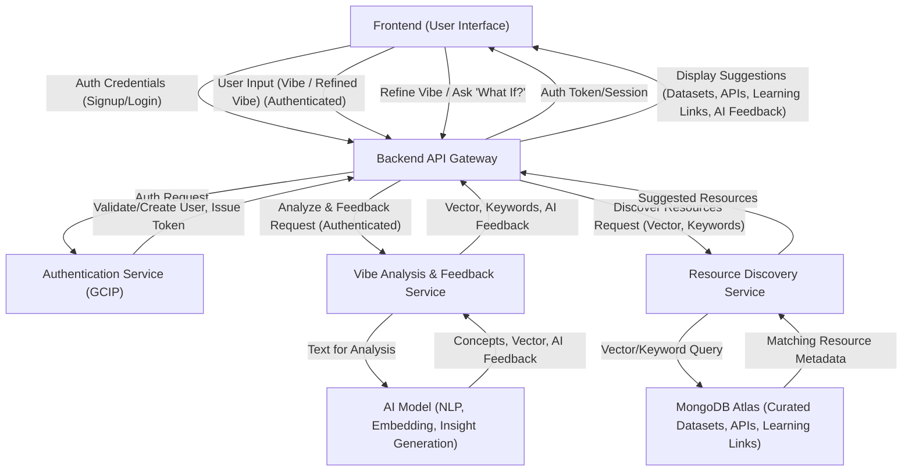

# System Patterns: VibeFlow

## Core Architecture
VibeFlow will be a web application with the following major components:

1.  **Frontend (Client-Side):**
    *   Built with React and TypeScript.
    *   Handles user input (the "vibe" description).
    *   Displays suggestions (datasets, APIs, learning resources, AI feedback).
    *   Facilitates interactive exploration of suggestions.
    *   Handles user interactions for "what if" scenarios and vibe refinement.
    *   Handles user authentication (sign-up, login, sign-out) interactions.

2.  **Backend (Server-Side):**
    *   Built with a scalable framework (e.g., Node.js/Express, Python/FastAPI - to be decided).
    *   **Authentication Service:**
        *   Manages user registration, login (e.g., issuing JWTs), and logout.
        *   Integrates with Google Cloud Identity Platform.
    *   **Vibe Analysis & Feedback Service:**
        *   Receives the user's text input (requires authenticated session).
        *   Communicates with an external AI service (e.g., Google Gemini API) to:
            *   Extract key concepts, features, and potential data models.
            *   Generate a vector embedding of the "vibe."
            *   Generate AI-driven feedback/insights ("Vibe Check") on feasibility, complexity, etc.
        *   Handles "what if" scenario processing by re-analyzing modified vibes.
    *   **Resource Discovery Service (Data Matching):**
        *   Queries MongoDB Atlas using vector embeddings and keywords (from Vibe Analysis Service) to find:
            *   Semantically similar public datasets.
            *   Relevant APIs.
            *   (Future) Relevant open-source components/patterns.
            *   Curated learning resources (tutorials, documentation).
        *   Retrieves metadata for these resources to be displayed on the frontend.

3.  **Database (MongoDB Atlas):**
    *   **Curated Resource Collections:**
        *   **Datasets Collection:** Stores metadata about public datasets (name, description, source, category, keywords, sample data snippets, vector embeddings).
        *   **APIs Collection:** Stores metadata about APIs (name, description, common use cases, endpoint examples, links to documentation, vector embeddings).
        *   **(Future) Learning Resources Collection:** Stores metadata about tutorials, articles, documentation (title, summary, link, tags, vector embeddings).
        *   **(Future) Open-Source Components/Patterns Collection:** Stores metadata about reusable code or architectural patterns (name, description, link, tech stack, vector embeddings).

4.  **External Services:**
    *   **AI Model (e.g., Google Gemini):** For natural language understanding, feature extraction, vector embedding generation, and generating insights/feedback ("Vibe Check").
    *   **Google Cloud Platform:**
        *   **Cloud Run:** For hosting the VibeFlow platform (frontend and backend services).
        *   **Identity Platform:** For managing user identities and authentication flows.
        *   (Potentially other Google APIs as recommended to users, e.g., Maps, Natural Language, if relevant to their vibe).

## Key Technical Decisions & Patterns
*   **Microservices-oriented Backend (Potentially):** Backend services (Authentication, Vibe Analysis & Feedback, Resource Discovery) can be designed for future separation.
*   **API-Driven:** All interactions between frontend and backend services will be through well-defined APIs.
*   **Vector Search as a Core Technology:** MongoDB Atlas Vector Search is central to matching user intent with relevant datasets, APIs, and learning resources.
*   **AI-Assisted Insight and Feedback:** Leveraging LLMs to provide users with valuable feedback on their ideas and to help tailor resource suggestions.
*   **Focus on Curated Content:** The quality, relevance, and breadth of the curated datasets, API information, and learning resources in MongoDB are paramount to VibeFlow's value.
*   **Interactive Loop Design:** Frontend and backend must support an iterative process where users can refine their vibe, explore different facets of their idea, and receive updated suggestions and feedback.
*   **Emphasis on Free Tiers (for VibeFlow Platform):** Utilize free or cost-effective tiers of GCP and MongoDB Atlas for hosting and operating the VibeFlow platform itself.

## Component Relationships (High-Level - Revised for Interactive Refinement)

This diagram illustrates the revised flow focusing on iterative refinement and resource discovery. The VibeFlow platform itself is hosted on Google Cloud Run.
